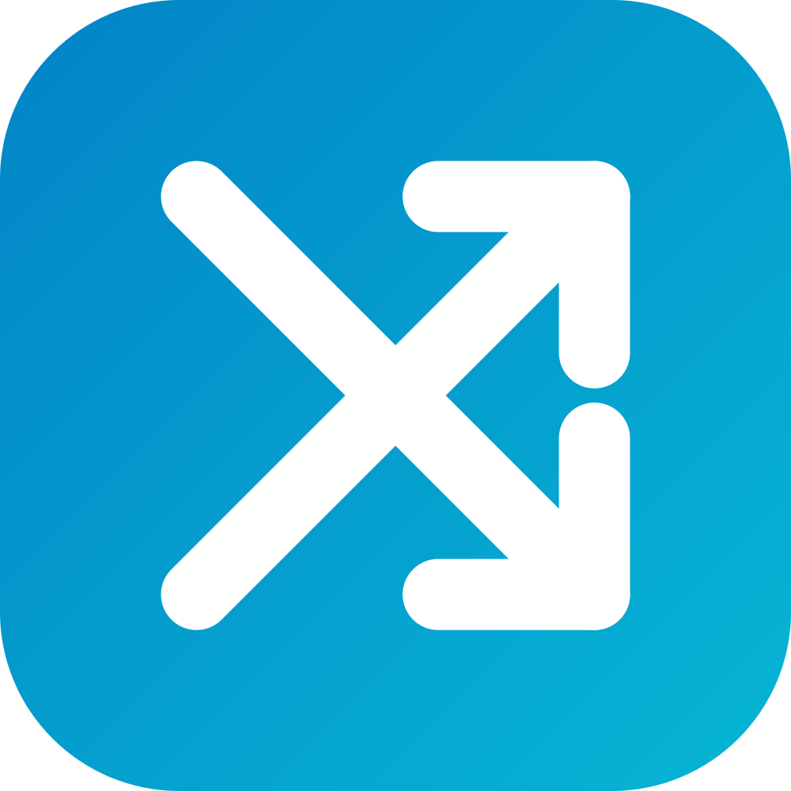

# OmniDesk Mobile

<p align="center">
  
</p>

<p align="center">
  <strong>Cross-Platform Local P2P Clipboard Sync & File Sharing for iOS & Android</strong><br>
  <em>Sincronização P2P de Área de Transferência e Envio de Fotos/Arquivos na Rede Local</em>
</p>

<p align="center">
  <a href="https://github.com/thyagoluciano/OmniDeskMobile/actions/workflows/ci.yml"></a>
  <a href="https://flutter.dev/"></a>
  <a href="https://dart.dev/"></a>
  <a href="#"></a>
  <a href="https://github.com/thyagoluciano/OmniDesk"></a>
  <a href="LICENSE"></a>
  <a href="CONTRIBUTING.md"></a>
</p>

<p align="center">
  <a href="README.md">🇧🇷 Português</a> &nbsp;•&nbsp;
  <strong>🇺🇸 English</strong>
</p>

<p align="center">
  <a href="#-what-is-omnidesk-mobile">About</a> &nbsp;•&nbsp;
  <a href="#-the-omnidesk-ecosystem">Ecosystem</a> &nbsp;•&nbsp;
  <a href="#-key-features">Key Features</a> &nbsp;•&nbsp;
  <a href="#-how-pairing-works">Pairing</a> &nbsp;•&nbsp;
  <a href="#-building-and-running">Build & Run</a> &nbsp;•&nbsp;
  <a href="#-system-permissions">Permissions</a> &nbsp;•&nbsp;
  <a href="#-community--contributing">Community</a>
</p>

---

## 📱 What is OmniDesk Mobile?

**OmniDesk Mobile** is the official mobile companion app for the [OmniDesk](https://github.com/thyagoluciano/OmniDesk) ecosystem. Built with **Flutter** for **iOS and Android**, it directly connects your smartphone or tablet to your desktop workstations (Linux, macOS, and Windows) across your local Wi-Fi network.

> [!NOTE]
> OmniDesk Mobile is designed as a companion app to [OmniDesk Desktop](https://github.com/thyagoluciano/OmniDesk). To experience the full feature set, OmniDesk must be running on your computer on the same local Wi-Fi network.

Unlike proprietary, cloud-dependent syncing tools, OmniDesk Mobile is **100% local and peer-to-peer (P2P)**:

- 🔒 **Zero Cloud & Absolute Privacy**: No texts, links, photos, or files ever transit through external servers or third-party cloud infrastructure. All data stays strictly on your local Wi-Fi.
- ⚡ **Local Network Speed**: High-bandwidth transfers between device and computer without broadband upload limits.
- 🛡️ **Hardware Secure Storage**: Pairing credentials and tokens are secured via platform hardware facilities (iOS Keychain and Android EncryptedSharedPreferences).
- 🚫 **Zero Telemetry**: No tracking SDKs, no behavioral analytics, and no background profiling.

---

## 🌐 The OmniDesk Ecosystem

OmniDesk unifies your devices seamlessly across your local network:

| Project | Target Platforms | Tech Stack | Description |
| :--- | :--- | :--- | :--- |
| 🖥️ **[OmniDesk](https://github.com/thyagoluciano/OmniDesk)** | Linux, macOS, Windows | Go, Web Dashboard, Native Tray | Desktop core engine: sync daemon, KVM/input sharing, CLI, and P2P server. |
| 📱 **OmniDesk Mobile** *(This repository)* | iOS, Android | Flutter, Dart, Hardware Crypto | Mobile companion app: QR code pairing, photo/file sharing, and clipboard bridge. |

### Architecture & Communication:

```
 ┌───────────────────────────────┐                  ┌───────────────────────────────┐
 │       OmniDesk Desktop        │                  │        OmniDesk Mobile        │
 │    (macOS / Linux / Win)      │                  │        (iOS / Android)        │
 │                               │                  │                               │
 │  • Go Daemon (Port 24850)     │   Local Wi-Fi    │  • HTTP Server (Port 24851)   │
 │  • Web Dashboard (/ui/)       │◄────────────────►│  • In-App QR Scanner          │
 │  • QR Session Generator       │  Bonjour / mDNS  │  • Gallery & File Picker      │
 │  • Desktop Clipboard Sync     │   P2P Sockets    │  • Secure Storage Service     │
 └───────────────────────────────┘                  └───────────────────────────────┘
```

---

## ✨ Key Features

- 📷 **1-Second QR Code Pairing**: Simply point your phone camera at the QR code displayed on your computer screen to establish mutual cryptographic trust.
- 🔍 **Automated Bonjour / mDNS Discovery**: Locates nearby OmniDesk instances on the LAN (`_omnidesk._tcp`) without typing IP addresses.
- 📋 **Seamless Clipboard Synchronization**: Copy text on your phone to paste on your PC, or copy on your desktop and receive it on mobile with instant notification.
- 🔁 **Anti-Echo Protection**: Built-in hashing prevents infinite clipboard feedback loops between machines.
- 📸 **Direct Photo & File Beaming**: Select pictures from your camera roll or browse files to beam them directly to your desktop's `~/Downloads/OmniDesk` folder.
- 📥 **Receive Files from Desktop**: Easily accept documents and pictures sent from your computer.
- 📜 **Transfer History Feed**: Clean visual activity feed tracking sent and received items.
- 🚀 **Embedded Lightweight HTTP Server**: Starts on port `24851` (or next free port) and validates all endpoints using cryptographic tokens.

---

## 📲 How Pairing Works

Pairing your phone with your workstation is fast and secure:

```
1. On Computer                    2. On Phone                      3. Connected!
   ┌──────────────────────┐          ┌──────────────────────┐         ┌──────────────────────┐
   │ OmniDesk Web Panel   │          │ OmniDesk Mobile App  │         │  Active Syncing      │
   │                      │          │                      │         │                      │
   │  [ Pair Phone (QR) ] │   ──►    │  [ Scan QR Code ]    │   ──►   │  📋 Clipboard OK     │
   │      (QR Code)       │          │  (Point Camera)      │         │  📁 Files OK         │
   └──────────────────────┘          └──────────────────────┘         └──────────────────────┘
```

1. Ensure your computer and smartphone are connected to the **same Wi-Fi network**.
2. On your computer, open `http://127.0.0.1:24850/ui/` (or click the tray icon > **Open Dashboard**).
3. Click the **Pair Phone (QR Code)** button to reveal the QR code and transient validation PIN.
4. On your mobile phone, open **OmniDesk Mobile** and tap the **Scan QR Code** icon.
5. Aim your camera at the computer screen.
6. The app instantly redeems the token, validates mutual trust, and begins synchronization!

---

## 🛠️ Building and Running

### Prerequisites

- [Flutter SDK](https://docs.flutter.dev/get-started/install) with Dart `>=3.0.6 <4.0.0` (`stable` channel recommended).
- **For iOS**: macOS with Xcode 15+ and CocoaPods (`sudo gem install cocoapods`). iOS 15.0 or later.
- **For Android**: Android Studio with Android SDK (API level 21 or later).
- An active instance of [OmniDesk Desktop](https://github.com/thyagoluciano/OmniDesk) on the same Wi-Fi network.

### Cloning & Running Locally

```bash
# 1. Clone the repository
git clone https://github.com/thyagoluciano/OmniDeskMobile.git
cd OmniDeskMobile

# 2. Install Flutter packages
flutter pub get

# 3. Run in development mode
# On iOS Simulator or connected iPhone:
flutter run -d ios

# On Android Emulator or connected Android device:
flutter run -d android
```

### Static Analysis & Testing

Verify that code quality checks and tests pass cleanly:

```bash
# Check code formatting
dart format --output=none --set-exit-if-changed .

# Run static linter
flutter analyze

# Run unit and widget tests
flutter test
```

### Building Release Packages

```bash
# Android Release (APK or App Bundle):
flutter build apk --release
flutter build appbundle --release

# iOS Release:
flutter build ios --release
```

---

## 🔒 System Permissions

OmniDesk Mobile requests only the minimum permissions necessary for local operation:

| Permission | Purpose | Platforms |
| :--- | :--- | :--- |
| **Camera** | Used exclusively to scan the pairing QR code from the computer monitor. | iOS and Android |
| **Local Network** | Used for ZeroConf discovery (`_omnidesk._tcp`) and direct HTTP transfers on LAN. | iOS and Android |
| **Photos / Media** | Allows users to pick photos from their gallery to send to their computer. | iOS and Android |

---

## 🤝 Community & Contributing

Community contributions are warmly welcome! Whether fixing bugs, polishing the UI, or proposing new integrations:

- 📖 **[Contributing Guide](CONTRIBUTING.md)**: Setup, branch naming, commit conventions, and PR checklist.
- 🤝 **[Code of Conduct](CODE_OF_CONDUCT.md)**: Our standards for an open, welcoming community.
- 🛡️ **[Security Policy](SECURITY.md)**: Vulnerability disclosure instructions.
- 🖥️ **[OmniDesk Desktop Repository](https://github.com/thyagoluciano/OmniDesk)**: The primary desktop engine.
- 💬 **[GitHub Discussions](https://github.com/thyagoluciano/OmniDesk/discussions)**: Ask questions, share ideas, and engage with the community.
- 🐛 **[Open an Issue](https://github.com/thyagoluciano/OmniDeskMobile/issues)**: Report bugs or request mobile features.

---

## 📄 License

Distributed under the [MIT](LICENSE) license &copy; 2026 Thyago Luciano.  
The OmniDesk brand and logos are intellectual property of the author.
